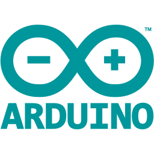

<h1 align="left" id="macropower-title">:wave: Hello there! I'm Madson Lemos</h1>

> Tools, languages, and other things that I like to work with.

<table>
  <tr>   
    <td align="center" width="96">
      
       Python
    </td>
    <td align="center" width="96">
      
       JavaScript
    </td>
    <td align="center" width="96">
      
       Node JS
    </td>  
    <td align="center" width="96">
      
       TypeScript
    </td>    
    <td align="center" width="96">
      
       React
    </td>
    <td align="center" width="96">
      
       React Native
    </td>
  </tr>
  <tr>
    <td align="center" width="96"> 
      
       Docker
    </td>
    <td align="center"  width="96">
      
       MySQL
    </td>
    <td align="center"  width="96">
      
       PostgreSQL
    </td>
    <td align="center" width="96">
      
       Arduino
    </td>
    <td align="center" width="96">
      
       Raspberry Pi
    </td>
    <td align="center" width="96">
      
       Linux
    </td>
  </tr>
</table>
